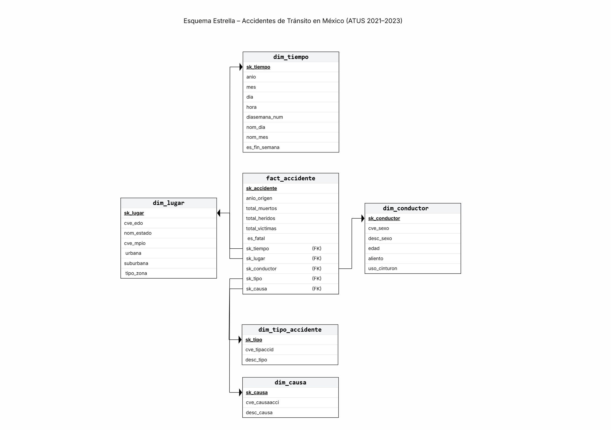

# Análisis de Accidentes de Tránsito Fatales en México (2021–2023)

**Alumna:** Guadalupe León Morales  
**Módulo 4:** Proyecto Final  
**Profesor:** Oscar Daniel Álvarez Cerna  
**Fuente:** INEGI — Accidentes de Tránsito Terrestre en Zonas Urbanas y Suburbanas (ATUS)

---

## Pregunta analítica

> ¿Qué combinación de día de la semana, hora, tipo de zona y causa presunta concentra la mayor proporción de accidentes con víctimas fatales en México?

Esta pregunta es accionable: sus respuestas permiten definir horarios y zonas prioritarias para campañas de prevención vial y operativos de tránsito.

---

## Estructura del repositorio

```
Proyecto_Final/
├── README.md
├── Datasets/
│   ├── ATUS_21.DBF          ← microdatos INEGI 2021 (356,315 registros)
│   ├── ATUS_22.DBF          ← microdatos INEGI 2022 (389,002 registros)
│   └── ATUS_23.DBF          ← microdatos INEGI 2023 (400,336 registros)
├── Scripts/
│   ├── 01_schema_ddl.sql              ← esquema estrella en Aurora PostgreSQL
│   ├── etl_pipeline.py                ← pipeline ETL completo
│   └── 02_consultas_analiticas.sql    ← 6 queries con SQL avanzado
├── Dashboard/
│   └── dashboard_accidentes_atus.pbix ← Power BI Desktop (2 páginas)
└── Docs/
    ├── diagrama_modelo.png        ← esquema estrella
    ├── aurora_cluster.png         ← evidencia cluster AWS
    ├── etl_validacion.png         ← validación post-carga
    ├── consulta_1.png
    ├── consulta_2.png
    ├── consulta_3.png
    ├── consulta_4.png
    ├── consulta_5.png
    ├── consulta_6.png             
    ├── dashboard_final.png        ← vista general Página 1
    └── dashboard_interactivo.png  ← filtro activo Página 2
```

---

## Dataset

| Atributo | Detalle |
|---|---|
| Fuente | INEGI — Programa ATUS |
| URL descarga | https://www.inegi.org.mx/programas/accidentes/ |
| Formato | DBF (microdatos anuales) |
| Años | 2021, 2022 y 2023 |
| Total de registros | 1,145,653 accidentes |
| Variables por registro | 40 columnas |

Cada registro representa un accidente de tránsito reportado por gobiernos municipales, con información de fecha, hora, lugar, tipo de accidente, causa presunta, características del conductor y número de víctimas por tipo.

---

## Modelo dimensional

Se diseñó un **esquema estrella** con grano de un accidente por fila, optimizado para consultas analíticas sobre fatalidad vial.

### Grano declarado

> Una fila en `fact_accidente` = un accidente registrado en el sistema ATUS del INEGI.

### Diagrama



### Tablas

| Tabla | Tipo | Descripción |
|---|---|---|
| `fact_accidente` | Hechos | Muertos y heridos por tipo de víctima, `total_muertos`, `total_heridos`, `es_fatal` |
| `dim_tiempo` | Dimensión | Año, mes, día, hora, día de semana, nombre del día, flag fin de semana |
| `dim_lugar` | Dimensión | Estado, municipio, zona urbana/suburbana |
| `dim_tipo_accidente` | Dimensión | 12 tipos de colisión según catálogo INEGI |
| `dim_causa` | Dimensión | 5 causas presuntas según catálogo INEGI |
| `dim_conductor` | Dimensión | Sexo, edad, aliento alcohólico, uso de cinturón |

### Decisiones de diseño

- **Surrogate keys con `SERIAL`:** el INEGI no asigna ID único por accidente — se generan claves propias para garantizar integridad referencial entre tablas.
- **`es_fatal` precalculado:** se genera en el ETL como booleano indexado para acelerar filtros del dashboard sin recalcular en cada query.
- **Catálogos fijos en el DDL:** `dim_tipo_accidente` y `dim_causa` tienen valores fijos del INEGI y se insertan directamente en el script de creación del schema.
- **7 índices en `fact_accidente`:** uno por cada FK más `es_fatal` y `anio_origen`, que son los filtros más frecuentes en las consultas analíticas.

---

## Implementación en AWS

La solución se desplegó sobre **Amazon Aurora PostgreSQL**.


| Parámetro | Valor |
|---|---|
| Motor | Amazon Aurora PostgreSQL |
| Schema | `accidentes` |
| Tablas | 6 (5 dimensiones + 1 fact) |
| Registros en fact_accidente | 1,145,653 |
| Índices | 7 |

Evidencia de carga exitosa: ver `Docs/etl_validacion.png`

---

## Cómo reproducir el proyecto

### 1. Descargar los datos

```
https://www.inegi.org.mx/programas/accidentes/
```

Descargar los archivos DBF de 2021, 2022 y 2023. Guardarlos en `Datasets/`.

### 2. Instalar dependencias

```bash
pip install pandas dbfread sqlalchemy psycopg2-binary
```

### 3. Crear el schema en Aurora

Conectarse al cluster Aurora con DBeaver y ejecutar:

```
Scripts/01_schema_ddl.sql
```

Seleccionar todo → `Ctrl+Enter`. Las 6 tablas y los catálogos se crean automáticamente.

### 4. Ejecutar el ETL

```bash
python Scripts/etl_pipeline.py
```

El script solicita las credenciales de Aurora de forma interactiva (sin exponerlas en código). Al finalizar imprime las métricas de validación:

```
filas_fact:          1,145,653
accidentes_fatales:     12,642
total_muertos:          14,385
total_heridos:         264,467
total_victimas:        278,852
```

### 5. Ejecutar las consultas analíticas

Abrir `Scripts/02_consultas_analiticas.sql` en DBeaver y ejecutar las 6 consultas una por una. Resultados capturados en `Docs/consulta_1.png` a `Docs/consulta_6.png`.

### 6. Abrir el dashboard

Abrir `Dashboard/dashboard_accidentes_atus.pbix` con **Power BI Desktop** (descarga gratuita en microsoft.com/power-bi).

---

## SQL avanzado

| # | Técnica | Propósito |
|---|---|---|
| 1 | CTE | Estados con más accidentes fatales por año |
| 2 | CTE + `RANK() OVER` | Ranking de estados por tasa de fatalidad |
| 3 | CTE + `SUM() OVER` | Distribución acumulada de fatales por estado |
| 4 | `CASE` + `COUNT FILTER` + `ROUND` | Riesgo relativo por franja horaria |
| 5 | GROUP BY + `COUNT FILTER` | Combinación día × hora × zona × causa más peligrosa |
| 6 | CTE + `LAG() OVER` | Variación año a año de fatales por estado (2021→2022→2023) |

Evidencia: `Docs/consulta_1.png` a `Docs/consulta_6.png`

---

## Dashboard

Desarrollado en **Power BI Desktop** — archivo: `Dashboard/dashboard_accidentes_atus.pbix`

El dashboard tiene **2 páginas** con un total de **6 visualizaciones**.

### Página 1 — Vista general


| # | Visualización | Pregunta que responde |
|---|---|---|
| 1 | Barras horizontales por estado | ¿Dónde ocurren más accidentes fatales? |
| 2 | Gráfico de anillos por franja horaria | ¿En qué momento del día hay más riesgo? |
| 3 | Línea por día de la semana | ¿Qué días son más peligrosos? |
| 4 | Circular por causa presunta | ¿Qué factores predominan en accidentes fatales? |

### Página 2 — Vista interactiva


| # | Elemento | Descripción |
|---|---|---|
| 5 | Slicer de día de la semana | Filtra todas las visualizaciones por día seleccionado |
| 6 | Tarjeta de total de accidentes | Muestra el conteo actualizado al aplicar filtros |

Al seleccionar "Domingo" en el slicer, la tarjeta cambia de **13 mil → 3 mil** y las gráficas se actualizan automáticamente. El filtrado cruzado también funciona haciendo clic en cualquier barra de la Página 1.

---

## Hallazgos principales

El análisis de 1,145,653 accidentes registrados entre 2021 y 2023 revela patrones claros de concentración del riesgo fatal. El **Estado de México** lidera con 1,241 accidentes fatales, seguido por Jalisco (920) y Chihuahua (864). En términos temporales, la **franja de madrugada (0–5 h)** concentra la mayor tasa de fatalidad relativa, aunque el volumen absoluto es más alto en la tarde-noche (18–21 h), cuando se combina mayor tráfico con condiciones de oscuridad.

Los **domingos** concentran significativamente más muertes (2,785) que cualquier otro día — casi el doble que los martes (1,284). Este patrón es consistente en los tres años analizados. La **causa presunta más frecuente es el conductor** (91.45% de los casos), lo que apunta a factores humanos como velocidad, distracción o alcohol. La consulta LAG confirma que Estado de México, Jalisco y Chihuahua empeoraron su tendencia entre 2021 y 2023.

---

## Tecnologías utilizadas

| Tecnología | Uso |
|---|---|
| Python 3 | ETL completo |
| pandas | Transformación de datos |
| dbfread | Lectura de archivos DBF del INEGI |
| SQLAlchemy + psycopg2 | Conexión y carga a PostgreSQL |
| Amazon Aurora PostgreSQL | Base de datos en la nube |
| Power BI Desktop | Dashboard interactivo (2 páginas) |
| DBeaver | Cliente SQL y administración de Aurora |
| GitHub | Control de versiones y entrega |
